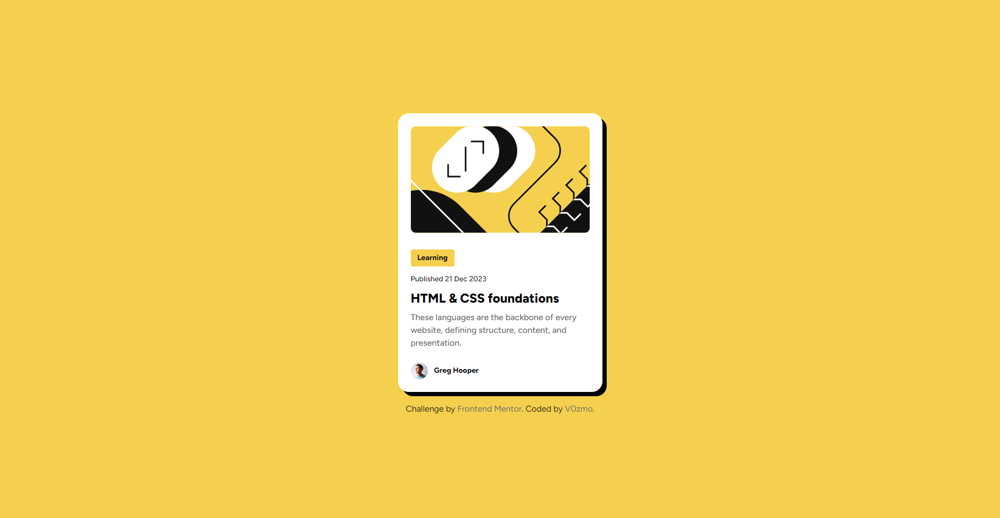

# Frontend Mentor - Blog preview card solution

This is a solution to the [Blog preview card challenge on Frontend Mentor](https://www.frontendmentor.io/challenges/blog-preview-card-ckPaj01IcS). Frontend Mentor challenges help you improve your coding skills by building realistic projects. 

## Table of contents

- [Overview](#overview)
  - [The challenge](#the-challenge)
  - [Screenshot](#screenshot)
  - [Links](#links)
- [My process](#my-process)
  - [Built with](#built-with)
  - [What I learned](#what-i-learned)
  - [Continued development](#continued-development)
  - [Useful resources](#useful-resources)
- [Author](#author)
- [Acknowledgments](#acknowledgments)

## Overview

### The challenge

Users should be able to:

- See hover and focus states for all interactive elements on the page

#### Self-Added Challange
- Added custom cursor
- Make card animation
- Interactive selection states

### Screenshot



### Links

- Live Site URL: [Github](./index.html)

## My process

### Built with

- Semantic HTML5 markup
- CSS custom properties
- Flexbox

### What I learned

I learned a lot by doing this one. I now know when to use proper unit measurements, and tidy a code (I'm not sure), and overall, it was a great improvement! I also added a little bit of a challenge for myself to push the limit of my knowledge.

I also learned that 'Custom' is not spelled 'Costum'. I'm sorry, but English is not my first language.

Although it's a copy-and-paste code and a simple one. I am still happy that I can use JavaScript lol, see below:

```js
const costumCursor = document.querySelector('#costum-cursor'); // Put #costum-cursor id to costumCursor variable.

document.addEventListener('mouseenter', () => {
    costumCursor.style.display = 'block';
}) // check if the cursor is entered the website page and display the costum cursor.

document.addEventListener('mouseleave', () => {
    costumCursor.style.display = 'none';
}) // check if the cursor is leaving the website page and hide the costum cursor.

const moveCursor = (e) => {
    const mouseY = e.clientY; // Get mouse Y position.
    const mouseX = e.clientX - 5; // Get mouse X position, and also offset it 5px (SVG messed the position).

    costumCursor.style.transform = `translate3d(${mouseX}px, ${mouseY}px, 0)`; // Follow the mouse based on the mouse position.

}

window.addEventListener('mousemove', moveCursor) // Execute the moveCursor function.
```

### Continued development

I need to develop how to use CSS, especially Flex and a little bit of HTML structure and hierarchy, maybe learn a bit of JavaScript could be fun (maybe not).

### Useful resources

- [W3Schools](https://www.w3schools.com) - This helped me with HTML, CSS, and JavaScript syntax.
- [Stack Overflow 2](https://stackoverflow.com) - Good for looking for a solution to the problem.
- [GeeksforGeeks](https://www.geeksforgeeks.org) - Good resource and learning material too!
- [Custom Cursor (Article)](https://webdesign.tutsplus.com/how-to-create-a-custom-mouse-cursor-with-css-or-javascript--cms-106724t) - Good article explaining how to implement custom cursor!
- [Custom Cursor (YouTube)](https://www.youtube.com/watch?v=OKvvjXu7WE8) - This is also a great one!

## Author

- Frontend Mentor - [@V0zmo](https://www.frontendmentor.io/profile/V0zmo)
- Github - [@V0zmo](https://github.com/V0zmo)

## Acknowledgments

Thank you [Useful resources](#useful-resources). And also thank you to [Jemima Abu](https://github.com/jemimaabu) and [Tyler Potts](https://github.com/TylerPottsDev) for the custom cursor tutorial! And also thank you for [Connor McLaughlin](https://github.com/Gingerlox) for the [last feedback](https://www.frontendmentor.io/solutions/qr-code-component-solution-html-css-flexbox-ZdYPFRR0Na) project about [QR Code Component](https://github.com/V0zmo/Frontend-Mentor-Challanges-Lists/tree/main/qr-code-component-main). You all really a wonderful person!
