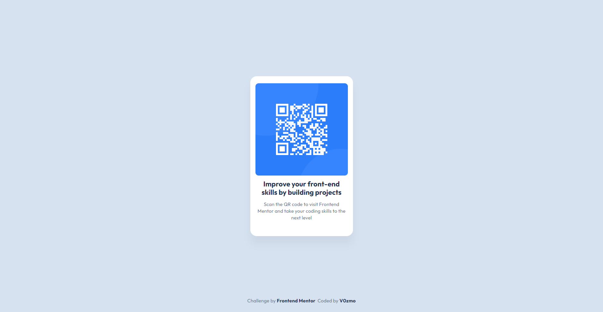

# Frontend Mentor - QR code component solution

This is a solution to the [QR code component challenge on Frontend Mentor](https://www.frontendmentor.io/challenges/qr-code-component-iux_sIO_H). Frontend Mentor challenges help you improve your coding skills by building realistic projects. 

## Table of contents

- [Overview](#overview)
  - [Screenshot](#screenshot)
  - [Links](#links)
- [My process](#my-process)
  - [Built with](#built-with)
  - [What I learned](#what-i-learned)
  - [Continued development](#continued-development)
  - [Useful resources](#useful-resources)
- [Author](#author)
- [Acknowledgments](#acknowledgments)

**Note: Delete this note and update the table of contents based on what sections you keep.**

## Overview

### Screenshot



### Links

- Live Site URL: [Github](https://v0zmo.github.io/Frontend-Mentor-Challanges-Lists/qr-code-component-main/index.html)

## My process

### Built with

- Semantic HTML5 markup
- CSS custom properties
- Flexbox

### What I learned

As this is my first time making something with HTML and CSS without YouTube tutorial I feel accomplished something. I think I got the grasp of the usage of <div> for contain element, semantic usage in HTML, element in CSS, and still confused on how the hell Flexbox work. Maybe next thing I should do is to understand Flexbox completely...

And i learn a few intresting thing like this one who use &nbsp for add space for <p> element and <a> element. If there is better alternative please tell me so:

```html
<div class="attribution">
        <p class="text">Challenge by&nbsp;<a href="https://www.frontendmentor.io?ref=challenge" target="_blank" class="text">Frontend Mentor</a>&nbsp;
        Coded by&nbsp;<a href="https://github.com/V0zmo" target="_blank" class="text">V0zmo</a></p>
      </div>
```

And somehow manage to get this lol:

```css
.qr--card {
    background-color: var(--white);
    width: 320px;
    height: 499px;
    display: flex;
    align-items: center;
    justify-content: center;
    flex-flow: wrap;
    border-radius: 20px;
    padding: 16px 16px 40px 16px;
    box-shadow: 0px 25px 25px 0 hsla(0, 0%, 0%, 0.047);
    transition: box-shadow 0.3s ease-in-out, transform 0.3s ease-in-out;
}
```

And I tried to use @media queries for responsive website:
```css
@media screen and (max-width: 460px) { /* 💀💀💀 */
    .qr--card {
        width: 240px;
        height: 320px;
    }
    
    .qr--code {
        width: 140px;
    }

    .qr--card .text {
        font-size: 14px;
    }
}
```

I feel proud. It's a mess thing. But I love this disaster 🥰🥰🥰

### Continued development

Flexbox. FLEX. FRICKING. BOX. Joke aside, I want to know much more about CSS element since I found it kinda confuse for responsive layout. Layout are hard. But also important for a beauty of website. It will be important for website making.

### Useful resources

- [W3Schools](https://www.w3schools.com) - This helped me to identify each element that I need to find or to know, really useful also for other language. A literal guidebook.
- [Stack Overflow](https://stackoverflow.com) - This is an amazing website for a solution really great fixing bug and other.

There is probably another website that I forgot to put, since when I'm searching always in Incognito Mode. Welp.

## Author

- Frontend Mentor - [@V0zmo](https://www.frontendmentor.io/profile/V0zmo)
- GitHub - [@V0zmo](https://github.com/V0zmo)

## Acknowledgments

Thank you for all the website, documentation, article, or even video. Without you, I can't not improve.
